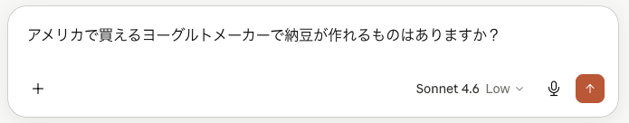
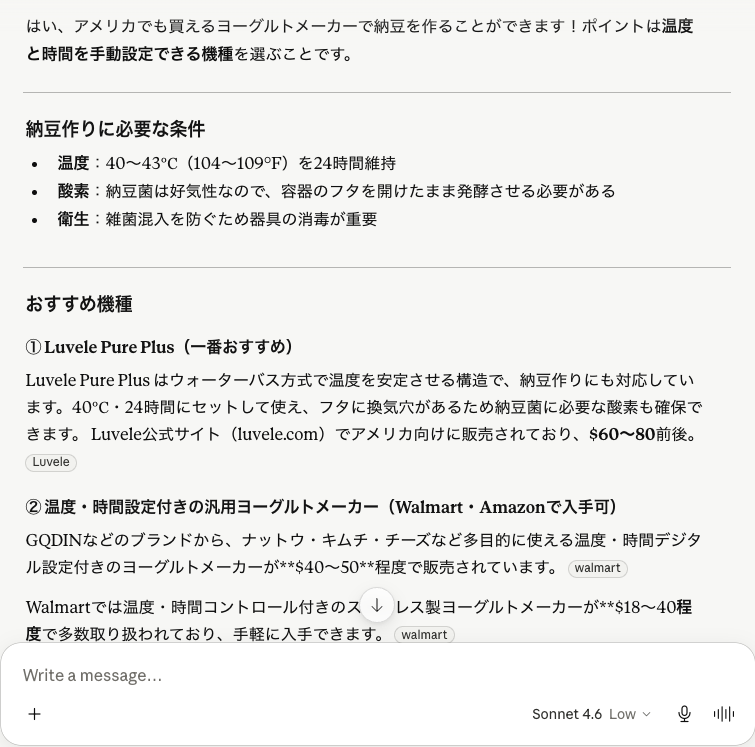

## Claudeって何？ — AIって怖くない？
Claude はAnthropicが提供するAIツールです。
最近ニュースでアンソロピックの名前をよく聞きますよね。ClaudeはChatGPTやGeminiの競合として注目されているAIです。
いったい何ができてどんなことに使えるのでしょうか。今回はClaudeについてまとめてみました。

## Claudeは何ができるの？
Claudeは自然言語処理が得意なAIで、以下のようなことができます：
- テキスト生成：文章やコードを生成することができます。
- 質問応答：質問に対して適切な回答を提供します。
- 会話：人と自然な会話をすることができます。
- 文章要約：長い文章を短く要約することができます。
- 翻訳：複数の言語間で翻訳することができます。

## どうやって使うの？ — 始め方
Claudeは無料で始めることができます。以下の手順で利用を開始できます：
1. Anthropicの[ウェブサイト](https://claude.ai)にアクセスします。
2. アカウントを作成します。
3. ログイン後、ダッシュボードからClaudeを利用できます。
4. テキストを入力して、Claudeに質問したり、文章を生成させたりしてみましょう。
5. またモバイルアプリも提供されているので、スマートフォンからも利用できます。

## Claudeに何を聞いたらいい？ — 使える場面
基本的に何を聞いても大丈夫ですが、たとえば私はこんなふうに使っています：
- 献立のアイディアを考えてもらう。料理が苦手な私はこれが一番多いかもしれません。
- メールや手紙の下書きを作成してもらう。文章を書くのが苦手な人には便利です。必ずしも完璧ではないことがあるので、送信する前に必ず内容を確認してくださいね。
- 読んだ記事や書類の内容を簡単に説明してもらう。コピーペーストでURLやテキストを入力すると、要点をまとめてくれます。
- アイデア出し：パーティーのテーマやプレゼントのアイデアなど、何かを考えるときに相談しています。
- 文章の校正：文章の校正や改善点を指摘してもらうことができます。
- 翻訳：英語の文章を日本語に翻訳してもらうことができます。
- 雑談：ちょっとした雑談も楽しめます。
- 病気のことやお金のことも答えてくれますが、あくまで参考程度にしてくださいね。

## Claudeが得意なこと・苦手なこと
これはあくまで現時点での私の経験による主観です。
- 得意なこと：文章生成、質問応答、会話、要約、翻訳などの自然言語処理全般が得意です。
- 苦手なこと：画像生成は現時点では直接対応していませんし、複雑な数学的計算などは苦手らしいです。また、最新のニュースや特定の専門的な知識については正確な回答ができないことがあります。 常に正確な情報を提供するわけではないので、特に重要なことについては他の情報源も確認してくださいね。

## ChatGPTやGeminiと何が違うの？
ClaudeはChatGPTやGeminiと同様の機能を持っていますが、いくつかの違いがあります：
- Claudeは画像生成ができない。ChatGPTやGeminiは画像生成も可能ですが、Claudeは基本的にテキストベースのAIです。文章と画像の両方を生成したい場合は、ChatGPTやGeminiの方が適しています。
- Anthropicは安全性に力を入れていると言われており、Claudeはユーザーデータのプライバシーを重視しています。とはいえ、個人情報は入力しないように注意してくださいね。

## 安全に使うために知っておきたいこと
Claudeは便利なツールですが、以下の点に注意して安全に利用してください：
- 個人情報を入力しない：住所や電話番号、クレジットカード情報などの個人情報は絶対に入力しないでください。
- 重要な決定をClaudeに頼らない：健康やお金など重要な決定は専門家に相談してください。Claudeはあくまで参考程度の情報を提供するツールであり、完全に正確な情報を提供するわけではありません。
- 生成された内容を確認する：Claudeが生成した文章や回答は必ずしも正確であるとは限りません。特に重要な内容については、他の情報源も確認してください。
- 過度に依存しない：Claudeは便利なツールですが、過度に依存しないようにしましょう。自分の判断力や批判的思考を保つことが大切です。

## 実際に試してみよう
ちょうど納豆を自宅で作れたらいいのにと思っていたので、Claudeにアメリカでも納豆が作れるヨーグルトメーカーが手に入るか聞いてみました。以下がそのやりとりです。

答えの中にあるメーカーをWalmartとAmazonで検索してみたところ、どちらでもヒットしませんでした。Claudeの情報は古かったようです。Claudeの情報をすべて鵜呑みにするのではなく、他の情報源も確認することが大切ですね。 

## まとめ
Claudeは自然言語処理が得意なAIツールで、テキスト生成や質問応答、会話、要約、翻訳などができます。無料で始めることができ、様々な場面で活用できますが、個人情報を入力しないことや、重要な決定をClaudeに頼らないことなど、安全に利用するための注意点もあります。ChatGPTやGeminiと比べると画像生成ができないなどの違いもあります。実際に試してみると、便利なツールである一方で、情報が古かったり正確でないこともあるので、他の情報源も確認することが大切だと感じました。Claudeは今後も進化していくと思うので、これからも注目していきたいと思います。