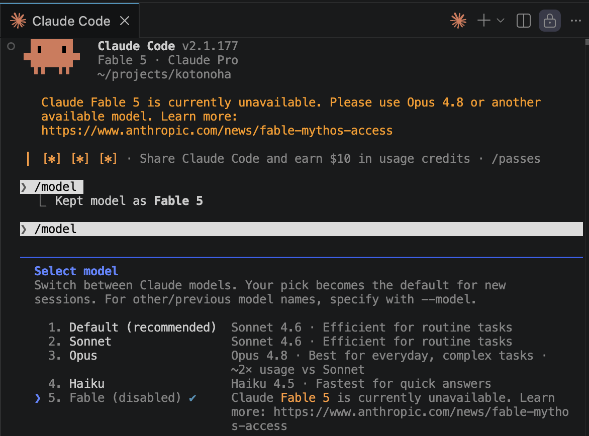

## Claude Fable5
Anthropicは6月9日にClaude Fable5をリリースしましたが、6月12日に一時停止することを発表しました。理由は、モデルの安全性に米政府から待ったがかかったためです。米政府は、Claude Fable5が悪用される可能性があると懸念しているようです。Anthropicは、モデルの安全性を向上させるために取り組んでいると述べていますが、具体的な改善策についてはまだ明らかにされていません。

## 外国人による使用を禁止？
米政府は居住国にかかわらず外国人によるClaude Fable5の使用を阻止することを要求しています。これには外国籍のAnthropic従業員も含まれる可能性があると報じられています。私もアメリカに住む外国人なので対象になります。この要求が実行されることになったらClaudeを使用するにはユーザーは国籍を証明しないといけなくなるのでしょうか。いったいどのように実行されるのか、政府による監視という点でも興味深いです。IPアドレスで地域は特定できたとしても、ユーザの国籍を確認するとなると膨大な手間がかかりそうです。私は職場でもClaudeにはものすごくお世話になっているので、もし今後Fable5だけではなくClaude自体が使えなくなったら正直いって困ります。

## Fable5の性能
Fable5がリリースされたのが平日で、私は週末にいろいろやってみようと思ってのんびり構えていたので、残念ながらその実力を試す機会を逃してしまいました。唯一このブログサイトのコードベースのレビューをやってもらっただけです。確かに的確にバグを見つけてくれましたが、他のモデルとの差が出るようなタスクではなかったです。Fable5が前のモデルと比べてどのくらいすごいのか実際に試してみたかったです。今後の再リリースに期待しています。

## まとめ
Claude Fable5はリリースされたばかりですが、米政府の懸念により一時停止されることになりました。AIのサイバーセキュリティ問題が今後も議論されていくと思いますが、どのような展開になるのか注目していきたいと思います。

