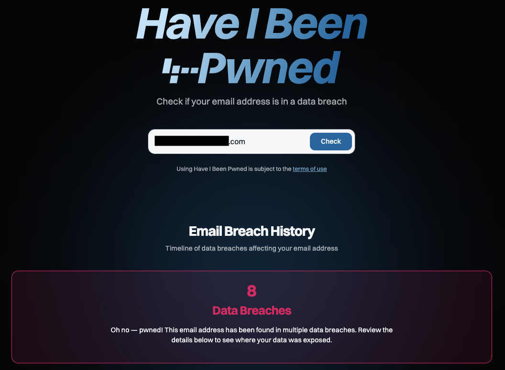

## 最近あやしいメールが増えた

最近AmazonやAppleを語ったメールが連続して届きました。「支払いに失敗しました」とか「アカウントがロックされました」といった内容で、リンクをクリックするとおそらくフィッシングサイトに誘導されるだろうメールです。見た目は本物そっくりで、メールアドレスや名前も一見正しく見えるので、本物のメールと間違えそうになります。こういうメールが急に増えたということは、自分のメールアドレスがまたどこかで漏れたのではないかと不安になりました。

## Have I Been Pwnedでチェック

さっそく自分のメールアドレスが漏洩していないか[Have I Been Pwned](https://haveibeenpwned.com/)というサイトでチェックしてみました。これは、過去に流出したデータベースをもとに、自分のメールアドレスが含まれているかどうかを確認できるサービスです。自分のメールアドレスを入力して調べてみると、8件のデータブリーチがあったという結果が出ました。しかし2024年のAT&Tからの漏洩が最後で、最近のものは出てきませんでした。単にまだこちらのデータベースにまだ反映されていないだけかもしれませんが、少し安心しました。そうそう、AT&Tのデータブリーチがあった頃はヨーロッパの国からのあやしいメールが大量に届きました。思えばあの頃はすぐに「あやしい」と思えるメールが多かったけど、最近はAIのおかげで本物そっくりのフィッシングメールが増えてきて、見分けるのが難しくなってきました。とにかくメールのリンクはすぐにクリックしない、これにつきます。AIの進化は便利な反面、こういう悪用のされ方もあるので、注意が必要です。

## "pwned"とは？

ところで、"pwned"という言葉は、もともと「所有する」という意味の"owned"のミスタイプから生まれたネットスラングで、「ハッキングされる」「乗っ取られる」といった意味で使われます。Have I Been Pwnedのサイト名は、「自分のメールアドレスがハッキングされていないか？」という意味になります。実は私は質屋を意味する"pawn"から由来したとずっと勝手に勘違いしていました。