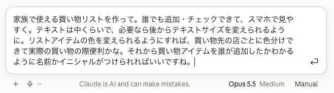
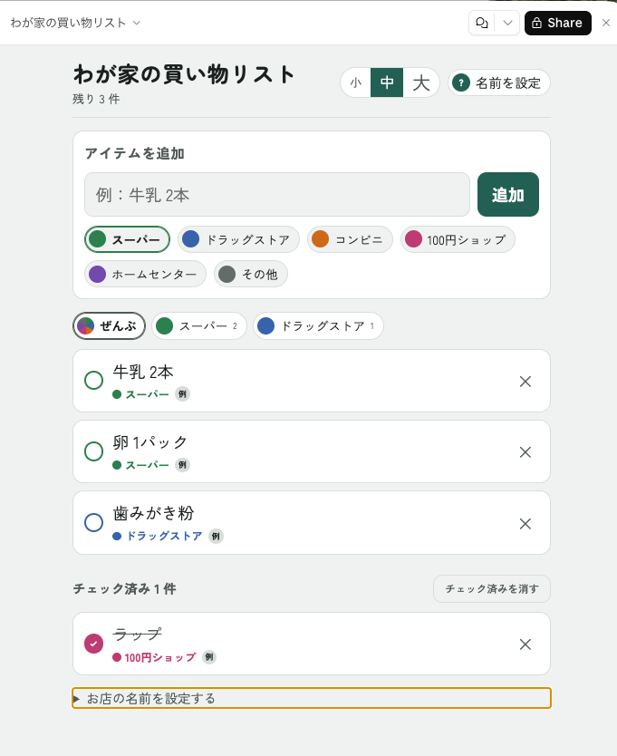

## 最近忘れっぽくなった

最近、年のせいか買い物に行くたびに「あれ、何を買うんだっけ」と忘れてしまうことが増えてきました。以前は付箋に買うものをメモしていたのですが、持病のせいで指の関節が曲がらなくなり、ペンを持つのが辛くなってしまい、メモをするのも億劫になってしまいました。そこで、Claude に買い物リストアプリを作ってって頼んでみました。

## いったい何が出来てくるのかお楽しみ

詳しい仕様の指定は一切なし。老眼が進んできたので、文字の大きさを切り替えられるように、そして買い物先のお店ごとに色を分けられるようにしてほしい、家族と共有することもできるように誰がどのアイテムを追加したのか分かるようにしてほしい、とだけ伝えました。以前、自分で使うモバイルアプリをClaude Code で作ってもらったことがあって、その時は使うライブラリーなどテックスタックをすべて指定しましたが、今回は一切なし。

## すべておまかせで出来たのがこれ

プロンプトを入れて、数分後には買い物リストアプリのプロトタイプが出来上がっていました。

正確に言うと、これはClaudeの[アーティファクト](https://support.claude.com/ja/articles/17153992-%E3%82%A2%E3%83%BC%E3%83%86%E3%82%A3%E3%83%95%E3%82%A1%E3%82%AF%E3%83%88%E3%81%A8%E3%81%AF%E4%BD%95%E3%81%8B-%E3%81%A9%E3%81%AE%E3%82%88%E3%81%86%E3%81%AB%E4%BD%BF%E7%94%A8%E3%81%99%E3%82%8B%E3%81%AE%E3%81%8B)という機能で、Claudeが生成した成果物を実際に確認したり誰かと共有することができる仕組みです。今回のプロトタイプも特に問題もなさそうだったので、そのまま”Publish"ボタンを押して公開しました。すると"claude.ai/artifact/" ドメインにデプロイされ、リンクを使ってブラウザからアクセスできるようになりました。実際に使ってみると、文字の大きさを簡単に切り替えられ、買い物先ごとに色分けされたリストが表示され、家族が追加したアイテムも一目で分かるようになっていました。

入力したデータはデータベースではなく専用ストレージに保存されるようで、最大20MBまでのテキストデータが保存可能とのことです。これなら、日常の買い物リスト程度であればなんとかなるでしょう。画像やバイナリーデータは保存できないようなので、レシートの写真を保存したいとか、そういう用途で発展させるのは難しそうです。ただし、Claudeの無料プランではストレージは使えないとのことです。

またアーティファクトの使用に関して、このような単純なリストを保存するといったAIを使わない用途であれば今のところ無料で利用できるようです。AIの機能が必要なアプリの場合は、仕様した分だけ課金されるようなのでご注意ください。

## まとめ

Claude に買い物リストアプリを作ってもらった結果、私のように忘れっぽくなった人間でも、簡単に買い物リストをスマホから管理できるようになりました。文字の大きさを切り替えられる機能や、買い物先ごとの色分け、家族との共有機能も期待通りに動作しました。AIを使わない単純なリスト保存であれば無料で利用できる点も魅力です。今後、画像やバイナリーデータの保存が可能になれば、さらに便利になるでしょう。

技術的な知識がなくても、プロンプトを通じて自分の要望を伝えるだけでアプリが作れる点は非常に魅力的です。今後も、日常生活の中で役立つAIアプリの活用方法を模索していきたいと思います。
